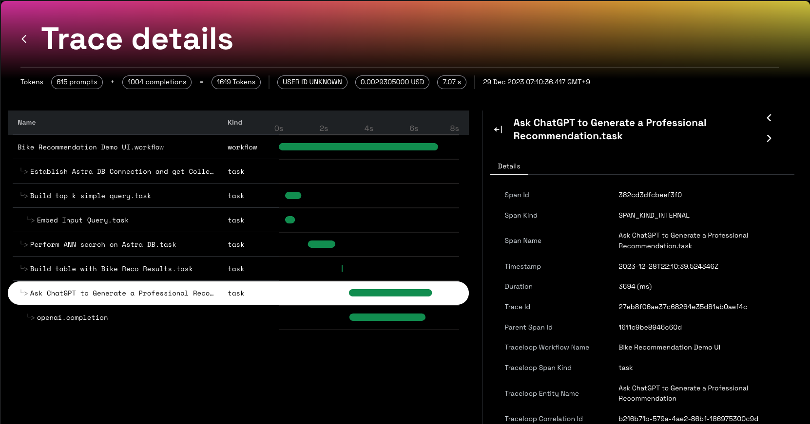
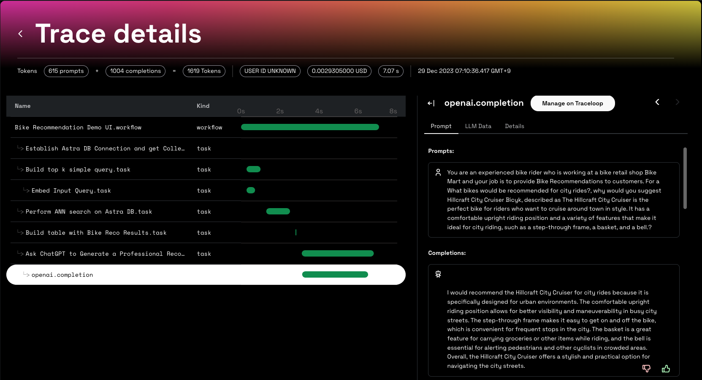

# Bike Recommendation Engine
Uses a small set of bike review/description to generate bike recommendations.

## Setup
- You will need accounts for the following services as well as the relevant tokens and API keys.
  - Astra Vector DB
  - OpenAI API
  - Traceloop

- Create a .env file with following values
```sh
  ASTRA_DB_APPLICATION_TOKEN=AstraCS:...
  ASTRA_DB_API_ENDPOINT=https://...astra.datastax.com
  ASTRA_COLLECTION=
  TRACELOOP_API_KEY=
  OPENAI_API_KEY=
  LIMIT_TOP_K=5
```
Provide TRACELOOP_API_KEY only if you want telemetry to be enabled

## Load data
At this point in time (Dec 2023), direct loading via API has some issues.
Currently this script will generate a JSON file that can be uploaded to the Astra Vector DB that you have created.

```sh
python load_embeddings.py
```
## Run demo from command line
You can interact with the demo on the command line.
```sh
python demo.py
```
## Launch UI
This app uses streamlit to run the UI
```sh
streamlit run demo-ui.py
```
## Open Telemetry/Traceloop view


